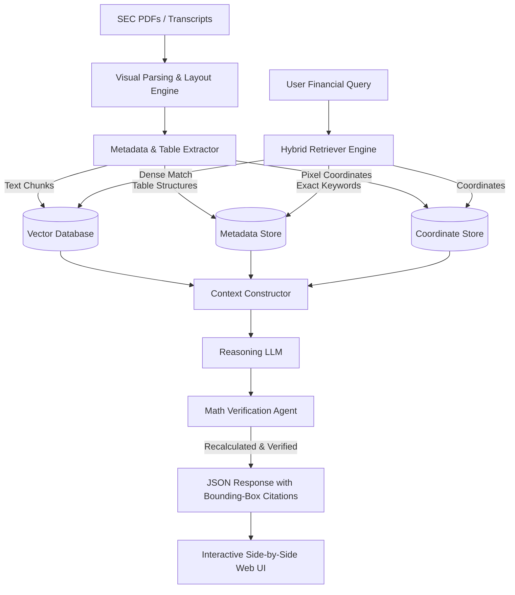

# FinRAG: Institutional Earnings Report Analyst Platform

[](https://opensource.org/licenses/MIT)
[](https://www.python.org/downloads/)
[]()
[](engineering_design_document.md)

FinRAG is an institutional-grade, document-intelligence and retrieval-augmented generation (RAG) platform purpose-built for financial analysts, portfolio managers, and equity researchers. It automates the parsing, analysis, and cross-referencing of unstructured financial reports—including SEC Form 10-K, 10-Q filings, earnings call transcripts, press releases, and investor presentations.

Unlike generic chatbot interfaces, FinRAG is engineered from first principles to ensure **numerical precision**, **strict footnote attribution**, and **pixel-level bounding-box citations** of source materials.

For a detailed review of the product strategy, persona mappings, and risk mitigations, read our complete [Engineering Design Document](engineering_design_document.md).

---

## 🚀 Key Features

*   **Structure-Aware Visual Parser:** Extracts complex multi-column financial tables, preservation of row/column headers, negative values, and nested accounting footnotes.
*   **Semantic Table Chunker:** Prevents context splitting on tables, keeping quantitative data together with its immediate contextual headers.
*   **Hybrid Retrieval Engine:** Combines dense vectors (optimized with a finance-tuned embedding model) with sparse keyword queries (BM25) to accurately match exact regulatory sections (e.g., "ASC 606", "Item 1A").
*   **Dual-Pass Verification Loop:** An automated mathematical and factual audit agent that runs calculations (e.g., margins, ratios) using a Python sandboxed execution environment to prevent LLM hallucinations.
*   **Bounding-Box Citations:** Every qualitative claim or number in the generated response contains clickable references that display the exact source page, paragraph, or table cell side-by-side.
*   **Difference Engine (MD&A & Risk Factors Diff):** Automatically compares risk factors or management guidance across sequential quarters to isolate new risk disclosures.

---

## 🏛 Architecture Overview



---

## 📂 Repository Layout

```text
fin-rag/
├── docs/
│   └── architecture.png       # Architecture diagrams and assets
├── finrag/                    # Core application package
│   ├── parser/                # LayoutLM/OCR pdf parsers and table extractors
│   ├── chunker/               # Structure-aware chunking modules
│   ├── indexer/               # Vector and metadata indexing logic
│   ├── retriever/             # Hybrid sparse/dense retrieval controller
│   ├── agent/                 # LLM Orchestrator, math verification loop
│   └── ui/                    # Gradio/Streamlit browser interface
├── tests/                     # Unit and integration test suite
├── .env.example               # Configuration template for API keys & DBs
├── pyproject.toml             # Python package dependencies & tool settings
├── README.md                  # Project homepage documentation
└── engineering_design_document.md # Comprehensive product specifications
```

---

## 🛠️ Quick Start & Installation

### Prerequisites
1. **Python 3.10+**
2. **System Dependencies:**
   * **Poppler:** Required for PDF rendering and page conversion.
     * *Ubuntu/Debian:* `sudo apt-get install poppler-utils`
     * *macOS:* `brew install poppler`
     * *Windows:* Install via Chocolatey `choco install poppler` or download binary release.
   * **Tesseract OCR:** Required for scanned document parsing.
     * *Ubuntu/Debian:* `sudo apt-get install tesseract-ocr`
     * *macOS:* `brew install tesseract`

### Step 1: Clone the Repository
```bash
git clone https://github.com/sreeram0343/fin-rag.git
cd fin-rag
```

### Step 2: Setup Python Virtual Environment & Dependencies
We use **Poetry** for dependency management:
```bash
# Install Poetry if not already installed
curl -sSL https://install.python-poetry.org | python3 -

# Install dependencies
poetry install
```

### Step 3: Configure Environment Variables
Copy the template `.env.example` file and configure your API keys:
```bash
cp .env.example .env
```
Open `.env` and fill in the necessary keys:
```env
OPENAI_API_KEY=your-openai-api-key
PINECONE_API_KEY=your-pinecone-api-key
PINECONE_ENVIRONMENT=your-pinecone-region
LOG_LEVEL=INFO
```

### Step 4: Run the Document Ingestion Pipeline
Upload and process a document (e.g., Apple's Q3 10-Q):
```bash
poetry run python -m finrag.parser.ingest --file path/to/apple_q3_10q.pdf --ticker AAPL --quarter Q3 --year 2026
```

### Step 5: Launch the Interactive UI
Run the local interface for testing QA and document comparisons:
```bash
poetry run python -m finrag.ui.app
```
Access the dashboard locally at `http://localhost:7860`.

---

## 🧪 Verification & Testing

Verify your setup by running the test suite:
```bash
poetry run pytest tests/
```
To run tests with code coverage metrics:
```bash
poetry run pytest --cov=finrag tests/
```

---

## 🛡️ Enterprise Security & VPC Deployments

FinRAG supports fully air-gapped enterprise deployments:
*   **Private LLM Support:** Compatible with local LLMs (e.g., Llama-3, Mistral) served via Ollama, vLLM, or AWS Bedrock.
*   **No Data Retention:** Data uploaded to the default cloud APIs is processed under zero-data-retention agreements.
*   **SSO Integration:** Configurable for Okta, Active Directory, or any SAML 2.0 provider.

---

## 📄 License

This project is licensed under the MIT License - see the [LICENSE](LICENSE) file for details.
