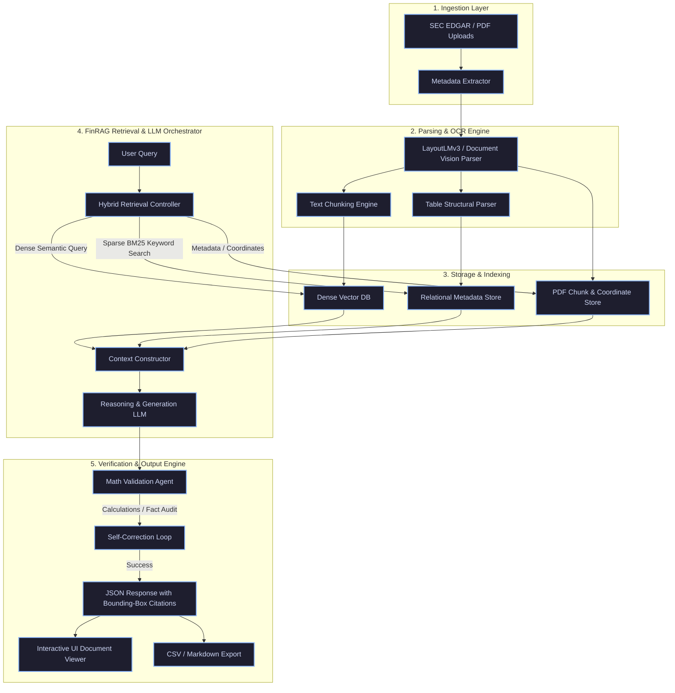

# FinRAG: Institutional-Grade Earnings Report Analyst Platform
## Product Architecture & Engineering Design Document

---

## 1. Executive Summary

In institutional finance, information is the primary source of competitive advantage. However, the volume, complexity, and fragmentation of corporate financial disclosures have outpaced the cognitive bandwidth of human analysts. 

**FinRAG** is an institutional-grade, document-intelligence and retrieval-augmented generation (RAG) platform purpose-built for financial analysts, portfolio managers, and equity researchers. By applying state-of-the-art document parsing, multi-modal semantic chunking, and verifiable LLM agent workflows to corporate earnings reports (SEC Form 10-K, 10-Q, earnings call transcripts, press releases, and investor presentations), FinRAG automates document intelligence. 

Unlike generic LLM wrappers, FinRAG is engineered from first principles to enforce **mathematical precision**, **pixel-level auditability (bounding-box citations)**, and **cross-document narrative synthesis** while maintaining strict enterprise compliance.

---

## 2. Problem Statement & First Principles Analysis

### 2.1 The Problem
Public companies release millions of pages of regulatory filings and unstructured transcripts every year. During earnings season, an equity analyst or portfolio manager must ingest, cross-reference, and analyze thousands of pages of complex PDF documents containing:
1. Multi-column financial tables.
2. Crucial qualitative disclosures hidden in footnotes.
3. Transcripts of management presentations and live Q&A sessions.
4. Executive summaries and investor slide decks.

Analyzing these documents is manual, error-prone, and highly time-sensitive. A single missed sentence regarding a change in revenue recognition policy or an adjusted covenant threshold can lead to severe capital losses or missed investment opportunities.

### 2.2 Target Users & Persona Mapping
The primary users of FinRAG are institutional investment professionals who require high precision, deep reasoning, and rapid turnarounds:
*   **Buy-Side Equity Analysts / Portfolio Managers (Hedge Funds, Mutual Funds):** Focus on identifying long/short investment theses, earnings guidance beats/misses, and subtle shifts in executive tone or guidance.
*   **Sell-Side Equity Research Analysts (Investment Banks):** Responsible for writing detailed, initiation-of-coverage reports, maintaining financial models, and providing quick updates to institutional clients post-earnings.
*   **Credit & Risk Analysts:** Focus on covenants, debt structures, liquidity risks, and operational vulnerabilities buried in the Management Discussion & Analysis (MD&A) and Notes to Financial Statements.

### 2.3 Current Analyst Workflow
```
[SEC Filings / IR Releases] 
       │
       ▼ (Manual Download)
[Local PDF Directory] 
       │
       ▼ (Visual Skimming & Word Search "Ctrl+F")
[Highlighting Key Sections (MD&A, Risk Factors)]
       │
       ▼ (Manual Data Entry)
[Excel Financial Models / Valuation Sheets]
       │
       ▼ (Synthesizing & Writing)
[Investment Memo / Research Note] 
```

### 2.4 Critical Pain Points
*   **Information Overload:** Analysts are forced to skim 100+ page documents under tight time constraints, leading to cognitive fatigue and oversight of critical details.
*   **The Footnote Problem:** Critical accounting policies, litigation risks, segment breakdowns, and lease obligations are typically relegated to the "Notes to Consolidated Financial Statements." These notes are formatted in small fonts, highly dense text, and are separated physically from the main financial tables.
*   **Table Structure Distortion:** Traditional text extraction tools (e.g., standard PDF-to-text libraries) collapse columns, merge adjacent numbers, and lose grid structures, rendering tables illegible to standard LLM tokenizers.
*   **Narrative vs. Reality Discrepancy:** Management often presents a highly polished narrative in press releases and slides (e.g., highlighting "adjusted" EBITDA), while burying organic revenue declines, rising inventories, or margin pressure in the official SEC 10-Q filing.
*   **Lack of Historical Auditability:** Finding changes in risk factors or accounting estimations requires manual line-by-line comparison of this quarter's filing against previous quarters.

### 2.5 Why Existing Tools Are Insufficient

| Tool Type | Description | Gaps / Vulnerabilities in Institutional Finance |
| :--- | :--- | :--- |
| **Market Data Terminals** *(e.g., Bloomberg, FactSet, Refinitiv)* | Industry standard for structured metrics, consensus estimates, and financial data feeds. | Excellent for standardized historical numbers, but highly limited in parsing unstructured, company-specific qualitative disclosures. They lack semantic QA capabilities, cannot synthesize cross-document insights dynamically, and cost up to $25k/user/year. |
| **Generic Document Search & Chatbots** *(e.g., generic PDF chat tools, ChatGPT)* | General-purpose vector database + LLM search. | Extremely prone to numerical hallucinations (e.g., confusing millions with billions, misattributing negative signs). They strip table structures, lack financial domain taxonomy, cannot handle complex long-context reasoning, and offer no audit trails or private deployment models. |
| **Enterprise Search / Enterprise RAG** | General enterprise search tools. | Lack financial-specific parser configurations (e.g., parsing double-underlined totals, parenthetical values). They do not perform financial math validation, leading to untrustworthy outputs. |

---

## 3. Business Value Proposition

FinRAG addresses these limitations to unlock tangible business value for institutional asset managers:
1. **Compression of Time-to-Insight:** Reduces document parsing, comparison, and analysis time from **3-4 hours per company to under 5 minutes**, allowing analysts to cover a broader universe of companies during peak earnings season.
2. **Enhanced Alpha Generation:** Automatically flags subtle, non-obvious changes in management statements, risk factors, or accounting estimations that are frequently missed by manual reading.
3. **Institutional-Grade Risk Mitigation:** Prevents modeling errors by providing direct visual links (bounding boxes) to the original filing sources for every extracted number.
4. **Research Scalability:** Empowers small analyst teams to perform institutional-quality coverage across hundreds of mid-cap and small-cap stocks without adding headcount.

---

## 4. Functional Requirements

### FR-1: High-Fidelity Multi-Format Document Ingestion
*   The system must ingest PDF, HTML, and text versions of SEC Form 10-K, 10-Q, earnings transcripts, press releases, and investor presentation slides.
*   The system must preserve document metadata (ticker, period, fiscal year, report type, publication date).

### FR-2: Structure-Aware Visual & Textual Parsing
*   The parsing engine must extract complex, multi-column tables with their layout intact, including row headers, column headers, units (e.g., "in thousands"), parenthetical negative values, and associated footnotes.
*   The parser must identify document sections (e.g., Item 1A. Risk Factors, Item 7. MD&A in a 10-K) to allow targeted queries.

### FR-3: Multi-Modal & Financial-Specific Semantic Chunking
*   Chunking must not split sentences or break financial tables.
*   Tables must be chunked as distinct structural blocks, augmented with metadata linking them to their corresponding headers and footers.
*   Qualitative footnotes must be semantically linked to the specific cells or tables they reference.

### FR-4: Advanced Hybrid Retrieval Engine
*   The system must combine dense vector retrieval (optimized with a finance-tuned embedding model) with sparse retrieval (BM25) to capture both semantic meaning and exact financial terminology (e.g., "ASC 606", "non-GAAP reconciliation").
*   Retrieval must support structural metadata filtering (e.g., search *only* in "Risk Factors" or *only* in "Q&A section of the Q3 transcript").

### FR-5: Quantitative & Narrative Difference Engine (MD&A / Risk Factors Diff)
*   The system must compare two documents (e.g., Q1 10-Q vs Q2 10-Q) and generate:
    *   **Lexical Diff:** Visual highlighting of added/deleted text.
    *   **Semantic Diff:** LLM-generated summaries highlighting shifts in company stance, risks, or key metrics.

### FR-6: Multi-Document Synthesis & Question Answering
*   The QA engine must answer cross-document questions, such as: *"Compare the CEO's guidance on margin expansion during the Q3 call with the actual margins and risk factors disclosed in the Q3 10-Q."*
*   The response must synthesize qualitative comments with quantitative tables.

### FR-7: Bounding-Box Citations & Fact Auditing
*   Every numerical or qualitative statement in the LLM-generated response must be accompanied by an interactive source citation.
*   Clicking a citation must display the source document in a side-by-side viewer, highlighting the exact bounding box (page, paragraph, or table cell) from which the information was retrieved.

### FR-8: Downstream Financial Tool Integrations
*   The platform must allow analysts to export extracted tables to structured CSV or Excel format with pre-configured formulas for financial formulas (e.g., YoY changes).
*   Synthesized research memos must be exportable to Markdown, PDF, or directly to Research Management Systems (RMS).

---

## 5. Non-Functional Requirements

### NFR-1: Zero-Hallucination & Math Verification (Strict Factuality)
*   **Verification Agent:** The architecture must implement a dual-pass verification pipeline. A secondary verification agent must cross-check all numbers, ratios, and percentages in the output against the source chunks.
*   **Math Guardrails:** If the LLM generates a calculation (e.g., calculating operating margin), the verification agent must run deterministic Python code to recalculate the metric and flag discrepancies.

### NFR-2: Performance & Low Latency
*   P95 latency for document parsing and indexing must be < 60 seconds per 100-page PDF document.
*   P95 latency for interactive, single-document QA queries must be < 4 seconds.
*   P95 latency for complex, multi-document synthesis queries must be < 8 seconds.

### NFR-3: Security, Confidentiality & Compliance
*   **Data Isolation:** All customer documents, metadata, and query history must be isolated logically or physically (e.g., via multi-tenant database partitioning or single-tenant VPC deployments).
*   **Zero Data Leakage:** The system must not use client-uploaded documents or queries for model training. Integrations with LLM APIs must use enterprise-grade APIs with zero-data-retention (ZDR) policies.
*   **Authentication & Access Control:** Support Single Sign-On (SSO) via SAML/OIDC and Role-Based Access Control (RBAC).

### NFR-4: Scalability & High Availability
*   The indexing and storage system must scale horizontally to handle thousands of concurrent document uploads during the peak 2-3 weeks of corporate earnings seasons.
*   The web interface and API must maintain 99.9% uptime.

### NFR-5: Deterministic Citation Trails
*   The database must store coordinates (`page_number`, `x_min`, `y_min`, `x_max`, `y_max`) for all parsed chunks and tables.
*   The retrieval metadata must flow through the LLM context window and be preserved in the output JSON structure.

---

## 6. User Stories & Journey Mapping

### User Story 1: The Margin Discrepancy Hunt
> **As a** Buy-Side Equity Analyst,  
> **I want to** compare the management's verbal statements in the earnings transcript with the official SEC filing tables,  
> **So that** I can detect if management is masking deteriorating core business metrics with adjusted metrics.

#### User Journey:
1. **Ingestion:** The analyst uploads the Q2 Earnings Call Transcript and the Q2 10-Q for Company X.
2. **Querying:** The analyst types: *"The CFO mentioned that gross margins improved due to supply chain efficiencies. Does the 10-Q show an increase in gross margin? Detail any offsetting factors mentioned in the footnotes."*
3. **Retrieval & Reasoning:** FinRAG retrieves the transcript segment where the CFO talks about gross margins, fetches the Gross Margin row from the Consolidated Statements of Operations in the 10-Q, and pulls Note 4 (Inventory and Cost of Goods Sold).
4. **Synthesis:** The system generates an answer: *"While the CFO stated gross margin improved by 120 bps verbally, the 10-Q reveals that GAAP gross margins actually decreased by 40 bps, offset by a change in inventory valuation method detailed in Note 4 (page 14)..."*
5. **Auditing:** The analyst clicks on the "(10-Q page 14)" citation. The system opens the PDF to page 14, highlighting the paragraph describing the change in inventory valuation.

---

### User Story 2: Temporal Risk Analysis
> **As a** Risk Manager,  
> **I want to** run a semantic comparison between this quarter's "Risk Factors" section and the previous quarter's "Risk Factors,"  
> **So that** I can instantly see what new operational or legal risks the company has introduced.

#### User Journey:
1. **Comparison Selection:** The user selects "SEC Form 10-Q (Q2 2026)" and "SEC Form 10-Q (Q1 2026)" for Ticker: TSLA.
2. **Execution:** The user runs the "Risk Factor Compare" task.
3. **Analysis:** The platform's difference engine aligns the sections, tracks changes using lexical diff (red/green highlights), and sends the diffs to the semantic summarization engine.
4. **Output:** The user is presented with a structured dashboard:
    *   *Added Risk:* Cyber-security liability relating to a new autonomous driving software pilot.
    *   *Modified Risk:* Supply chain disruption language changed from "potential component shortages" to "active shipping delays in the Red Sea."
    *   *Deleted Risk:* Removed references to COVID-19 related factory closures.

---

### User Story 3: Financial Model Population
> **As an** Investment Banking Associate,  
> **I want to** extract the segmental revenue breakdown table directly into a structured CSV,  
> **So that** I can paste it into my valuation model without manual typing.

#### User Journey:
1. **Extraction Query:** The analyst asks: *"Extract the Segment Revenue and Segment Operating Income tables for the last three quarters."*
2. **Parsing & Retrieval:** The engine identifies the matching tables from the last three filings, maps the rows (e.g., "North America Retail", "International Retail") across columns (Q4, Q1, Q2).
3. **Layout Rendering:** The system displays the consolidated table in a spreadsheet grid on screen.
4. **Verification & Export:** The analyst reviews the numbers, verifies cell citations, and clicks "Export to Excel." The download initiates containing clean formatting, proper negative signs, and raw decimal numbers.

---

## 7. High-Level System Architecture



---

## 8. Success Metrics

### 8.1 Retrieval & Generation Accuracy (Quantitative)
*   **Retrieval Recall@K (K=5):** Target **> 96%** (Ensuring that the relevant financial text/table is within the retrieved context).
*   **Numerical Extraction Accuracy:** Target **> 99.5%** (Zero tolerance for transcription errors in extracted numbers).
*   **Hallucination Rate:** Target **0%** on numerical assertions in the final verified output.

### 8.2 Operational Metrics (Efficiency)
*   **Time-to-Insight (TTI):** Average time taken to answer a multi-document synthesis question (Target: **< 8 seconds** vs. **30-45 minutes** manual analysis).
*   **User Adoption (Daily Active Users):** Frequency of queries during quarterly earnings seasons (expected spikes of 10x normal load).

### 8.3 Technical Performance (NFR Metrics)
*   **P99 API Latency:** **< 5.0 seconds** for standard single-turn questions.
*   **Token Consumption Efficiency:** Ratio of generated summary output tokens to input tokens (Target optimization to minimize context-window overhead while preserving crucial footnotes).

---

## 9. Risks, Edge Cases & Mitigations

### 9.1 PDF Parsing Failures on Scan-only Documents
*   **Risk:** Some older files or local investor decks are stored as scanned images without a text layer.
*   **Mitigation:** FinRAG integrates a visual-document foundation model (like LayoutLMv3 or OCR engines like Tesseract/EasyOCR) to fall back to layout-aware visual OCR.

### 9.2 Table Spanning Multiple Pages
*   **Risk:** Financial tables (especially consolidated statement of cash flows) often run across page boundaries, resulting in broken structures.
*   **Mitigation:** The Table Structural Parser runs a structural stitching algorithm that merges adjacent tables sharing matching column schemas (e.g., matching column dates).

### 9.3 Ambiguous Footnotes
*   **Risk:** Footnotes referencing a small symbol (e.g., `(1)`) are located at the bottom of the page, decoupled from the table.
*   **Mitigation:** FinRAG uses semantic anchor links. The chunker maps superscript symbols in table cells directly to the corresponding text at the page bottom, appending it to the table's context.

### 9.4 Escalating LLM API Costs
*   **Risk:** Long financial reports (150+ pages) consume millions of tokens when analyzed across multiple quarters.
*   **Mitigation:** Implement multi-stage retrieval-hierarchies. A fast metadata filtering step maps queries to relevant sections (e.g., MD&A only) before calling heavy embedding models and generative LLMs.

---

## 10. Future Scalability & Platform Roadmap

```
Phase 1: Financial RAG Base  ──►  Phase 2: Multi-Agent Consensus  ──►  Phase 3: Fine-Tuned SLMs  ──►  Phase 4: Real-time Streams
 (Current Ingestion & QA)          (Cross-Document Validation)        (Private/Cost-Efficient)        (Live Earnings Calls)
```

### 10.1 Multi-Agent Collaborative Consensus
Introduce specialist LLM agents acting in consensus:
*   *The Extractor Agent* pulls the metrics.
*   *The Skeptic Agent* tries to find contradictions or discrepancies.
*   *The Synthesis Agent* resolves the differences and compiles the final report.

### 10.2 Fine-Tuned Small Language Models (SLMs)
To reduce token costs and enable fully on-premise execution for sensitive funds, we plan to fine-tune a financial SLM (e.g., 8B-14B parameter models like Llama-3-Instruct-Finance) on SEC corporate filings, optimizing it specifically for financial terminology, layout compliance, and numerical calculations.

### 10.3 Real-Time Streaming Audio Analysis
Extend ingestion from static text to live streaming audio. Analysts can query the platform *during* the live earnings call. The platform will transcribe the audio in real-time, correlate it against previous reports, and alert the analyst to changes or inconsistencies while the call is still ongoing.
